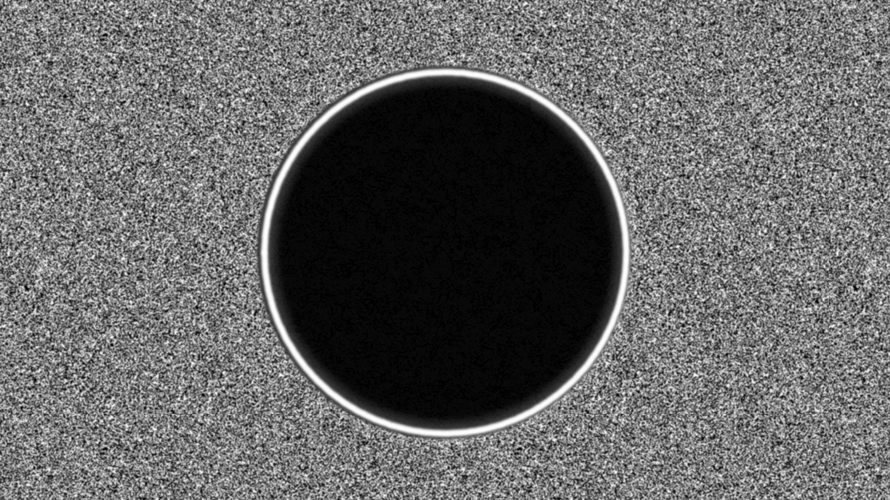
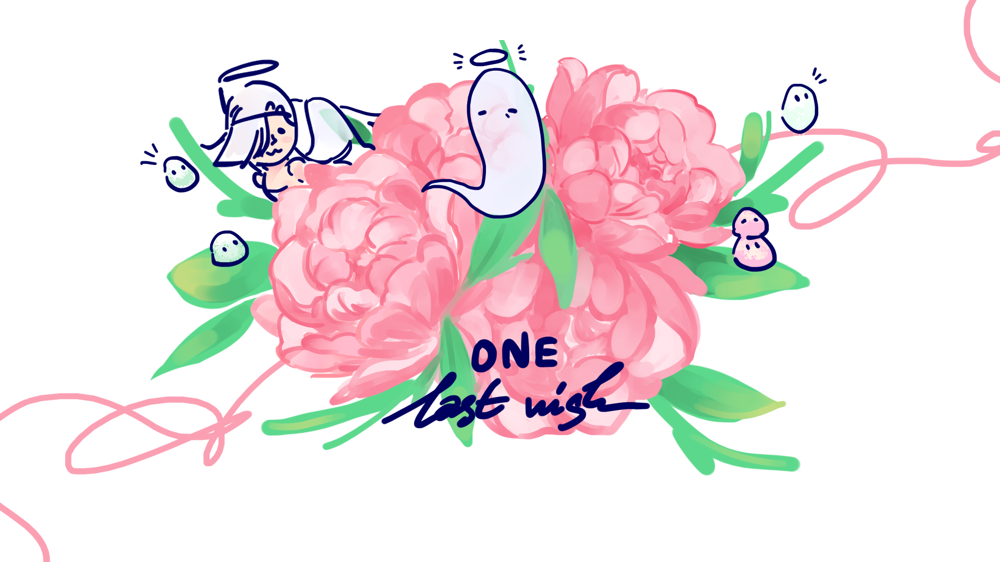

# Recent Games

## [A World of Order](https://choppa2.itch.io/awoo)

## [Seeker](https://choppa2.itch.io/seeker)

## [One Last Wish](https://choppa2.itch.io/one-last-wish)

All made with the Godot Engine,

My games are open-source, check them out on my GitHub profile!

# GitHub Funs

## [Electron Music Player](https://github.com/tghgg/music-player)
A toy project for me to learn Electron.

## [Text-to-JSON-Parser](https://github.com/tghgg/Text-to-JSON-Parser)
A Python parser which takes in Ren'Py-like scripts for quick game scriptwriting.

## [Natsuki-Pong-Game](https://github.com/tghgg/Natsuki-Pong-Game)
*Cursed. Do not play.*

# Free and Open Source, Linux Fan
Started using Linux with Lubuntu in early December 2019, now I can't think of anything else besides Linux :)

Fedora, Ubuntu, Silverblue, and of course Arch Linux, are my favorites.
Here are some of my setups:

# Songs
I sometimes make music with LMMS on [SoundCloud](https://soundcloud.com/falling_snowdin). They're mostly ambient, very repetitive songs which I prefer as I can listen to them while working. Go check them out.

***
Art for the games One Last Wish and A World of Order belongs to [AlexH_05](https://twitter.com/AlexH_05)

